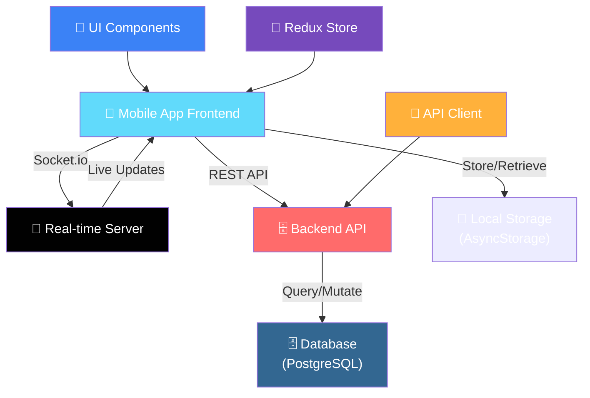
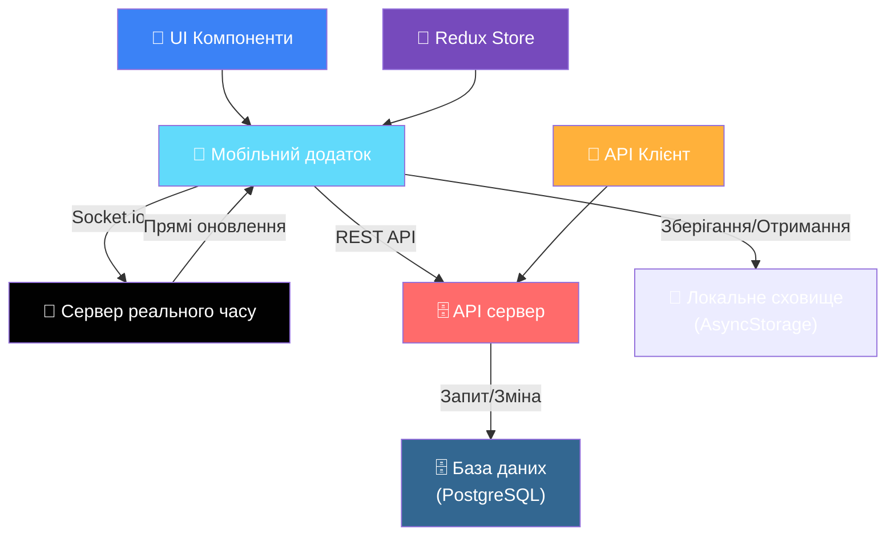

# Messenger

## 🎯 Мета створення проєкту

Цей проєкт створено як навчальний зразок повноцінного мобільного месенджера на React Native (Expo).  
Для початківця він корисний тим, що **показує реальну архітектуру живого застосунку** — від навігації та глобального стану до інтеграції з WebSocket-сервером у реальному часі.

Розбираючи код, новачок зможе:
- побачити, як організувати складний UI з вкладеною навігацією через Expo Router;
- зрозуміти, як керувати даними через Redux Toolkit та локальне сховище (AsyncStorage);
- навчитися працювати з формами та валідацією (React Hook Form + Yup);
- реалізувати миттєвий обмін повідомленнями через Socket.io;
- обробляти медіа (камера, галерея, маніпуляція зображеннями).

Таким чином, проєкт дає не просто набір бібліотек, а **цілісну картину** того, як сучасний мобільний застосунок будується, тестується та масштабується.

## 🎯 Project Purpose

This project was created as an educational example of a full-featured mobile messenger built with React Native (Expo).  
For a beginner, it is valuable because it **demonstrates the real architecture of a live application** — from navigation and global state management to real-time WebSocket server integration.

By exploring the code, a newcomer will be able to:
- see how to organize a complex UI with nested navigation using Expo Router;
- understand how to manage data with Redux Toolkit and local storage (AsyncStorage);
- learn to work with forms and validation (React Hook Form + Yup);
- implement instant messaging via Socket.io;
- handle media (camera, gallery, image manipulation).

---

## Участники команди/ Team members 

- [Iлля Епик](https://github.com/IllyaEpik)  |  [Illya Epik](https://github.com/IllyaEpik)
- [Попович Марк](https://github.com/markpopovich9)  |  [Popovych Mark](https://github.com/markpopovich9)
---

## Navigation

- [🇬🇧 Technology Stack](#technology-stack)
- [📦 Project Structure](#project-structure)
- [🚀 How to Run the Project](#how-to-run-the-project)
- [📋 Project Content & Module Overview](#project-content--module-overview)
- [📝 Conclusion](#conclusion)

---

## Навігація

- [🇺🇦 Технологічний стек](#технологічний-стек)
- [📦 Структура проєкту](#структура-проєкту)
- [🚀 Як запустити проєкт в роботу](#як-запустити-проєкт-в-роботу)
- [📋 Зміст проєкту та Огляд Модулів](#зміст-проєкту-та-огляд-модулів)
- [📝 Висновок](#висновок)

## Technology Stack

| Category | Technologies |
|----------|--------------|
| **Framework & Platform** |     |
| **Navigation** |  |
| **State Management** |    |
| **Forms & Validation** |    |
| **UI Components** |       |
| **Media & File System** |      |
| **Real-time** |  |
| **Utilities** |        |
| **Linting/Formatting** |  |

---

## Технологічний стек

| Категорія | Технології |
|-----------|------------|
| **Фреймворк та платформа** |     |
| **Навігація** |  |
| **Керування станом** |    |
| **Форми та валідація** |    |
| **UI компоненти** |       |
| **Медіа та файлова система** |      |
| **Real-time** |  |
| **Утиліти** |        |
| **Лінтинг/Форматування** |  |


## How to Run the Project

1. Clone the repository:

```bash
git clone https://github.com/IllyaEpik/messengerPhone
cd messengerPhone
```

2. Install the required modules:
```bash
npm install
```

3. Install Expo CLI globally (if not already installed):
```bash
npm install -g expo-cli
```

4. Install Expo dependencies:
```bash
npx expo install
```

5. Start the development server:

```bash
npm run start
```

6. Run on your device:
   - Use the Expo Go app on your smartphone
   - Scan the QR code displayed in the terminal

## Як запустити проєкт в роботу

1. Клонуйте репозиторій:

```bash
git clone https://github.com/IllyaEpik/messengerPhone
cd messengerPhone
```

2. Встановіть необхідні модулі:
```bash
npm install
```

3. Встановіть Expo CLI глобально (якщо ще не встановлено):
```bash
npm install -g expo-cli
```

4. Встановіть залежності Expo:
```bash
npx expo install
```

5. Запустіть сервер розробки:

```bash
npm run start
```

6. Запустіть на пристрої:
   - Використовуйте програму Expo Go на вашому смартфоні
   - Відсканюйте QR-код, відображений у терміналі

---

<!-- ## Project Structure / Структура проєкту -->

## Project Structure

```
src/
├── app/                      # Navigation and layout
│   ├── _layout.tsx           # Root layout
│   ├── index.tsx             # Home screen
│   ├── (auth)/               # Authentication screens
│   └── (tabs)/               # Main tabs navigation
│
├── modules/                  # Feature modules
│   ├── albums/               # Photo/video albums
│   ├── auth/                 # Authentication logic
│   ├── chat/                 # Messaging and chat
│   ├── friends/              # Friend management
│   ├── posts/                # Posts and feeds
│   └── profile/              # User profiles
│
├── shared/                   # Shared resources
│   ├── api/                  # API integration
│   ├── components/           # Reusable components
│   ├── static/               # Static assets
│   ├── styles/               # Global styles
│   └── types/                # TypeScript types
│
└── media/                    # Media assets
    └── icon/                 # App icons
```

---

## Структура проєкту

```
src/
├── app/                      # Навігація та макет
│   ├── _layout.tsx           # Кореневий макет
│   ├── index.tsx             # Головний екран
│   ├── (auth)/               # Екрани аутентифікації
│   └── (tabs)/               # Основна навігація табів
│
├── modules/                  # Модулі функцій
│   ├── albums/               # Фото/відео альбоми
│   ├── auth/                 # Логіка аутентифікації
│   ├── chat/                 # Повідомлення та чат
│   ├── friends/              # Керування друзями
│   ├── posts/                # Пости та стрічки
│   └── profile/              # Профілі користувачів
│
├── shared/                   # Спільні ресурси
│   ├── api/                  # Інтеграція API
│   ├── components/           # Повторно використовувані компоненти
│   ├── static/               # Статичні активи
│   ├── styles/               # Глобальні стилі
│   └── types/                # TypeScript типи
│
└── media/                    # Медіа активи
    └── icon/                 # Іконки додатка
```

---

## Project Content & Module Overview

#### 🔐 **Auth Module**
- Handles user authentication and account creation
- Login and registration screens
- Password reset functionality
- Session management using Redux and AsyncStorage
- Integration with backend authentication API

#### 💬 **Chat Module**
- Real-time messaging with Socket.io
- One-to-one and group conversations
- Message history and persistence
- Typing indicators and read receipts
- File and media sharing support

#### 📱 **Posts Module**
- Create, read, update, and delete posts
- Social feed with infinite scrolling
- Like, comment, and share functionality
- Post filtering and search
- Integrated with Redux for state management

#### 👥 **Friends Module**
- Add and manage friends
- Friend requests and approvals
- View friend lists and profiles
- Block/unblock functionality
- Search friends by username or email

#### 🖼️ **Albums Module**
- Create and organize photo albums
- Upload and manage images
- Album sharing with friends
- Image viewing and manipulation
- File system integration with Expo

#### 👤 **Profile Module**
- User profile management
- Edit personal information
- Profile picture management
- Signature functionality
- View other users' profiles

---

## Зміст проєкту та Огляд Модулів


#### 🔐 **Модуль Аутентифікації**
- Управління аутентифікацією та створенням облікових записів
- Екрани входу та реєстрації
- Функціональність скидання пароля
- Керування сеансом за допомогою Redux та AsyncStorage
- Інтеграція з API аутентифікації

#### 💬 **Модуль Чату**
- Обмін повідомленнями в реальному часі з Socket.io
- Один-на-один та групові розмови
- Історія та збереження повідомлень
- Індикатори введення та квитанції про прочитання
- Підтримка спільного використання файлів та медіа

#### 📱 **Модуль Постів**
- Створення, читання, оновлення та видалення постів
- Соціальна стрічка з нескінченним прокруткою
- Функціональність лайків, коментарів та спільного використання
- Фільтрування та пошук постів
- Інтегрований з Redux для керування станом

#### 👥 **Модуль Друзів**
- Додавання та керування друзями
- Запити дружби та затвердження
- Перегляд списків друзів та профілів
- Функціональність блокування/розблокування
- Пошук друзів за ім'ям користувача або електронною поштою

#### 🖼️ **Модуль Альбомів**
- Створення та організація фотоальбомів
- Завантаження та керування зображеннями
- Спільне використання альбомів з друзями
- Перегляд та маніпуляція зображеннями
- Інтеграція файлової системи з Expo

#### 👤 **Модуль Профілю**
- Керування профілем користувача
- Редагування особистої інформації
- Керування фото профілю
- Функціональність підпису
- Перегляд профілів інших користувачів

---


## Architecture Diagram



---

## Діаграма архітектури



---

## Conclusion

This project is the frontend part of a messenger application. The main goal was to create a fully functional mobile application using React Native (Expo) that interacts with the backend through REST API and real-time WebSocket connections.

**Key Learnings**
- Built a mobile interface using Expo Router for seamless screen navigation
- Mastered Redux Toolkit for managing global state in large React Native applications
- Implemented live chat with Socket.io client: learned how to listen to events, update UI in real-time, and prevent memory leaks
- Utilized React Hook Form + Yup for convenient form validation (login, registration, messaging)
- Worked with mobile media: selecting images from gallery/camera, processing with Expo Image Manipulator
- Strengthened TypeScript typing skills, making code more reliable during backend integration

**Why This Experience is Valuable**
I learned how to combine dozens of libraries into a single working interface that communicates with the server both synchronously (REST) and asynchronously (WebSocket). Collaborating with Mark helped understand how to distribute tasks between frontend and backend, align API contracts, and keep shared code clean.

**Future Development**
The project can be expanded into a full-featured messenger:
- Add push notifications through Firebase Cloud Messaging (FCM)
- Implement end-to-end encryption for messages
- Improve UX: gesture support, animations, dark theme
- Integrate video and audio calls (e.g., via WebRTC)
- Prepare for Google Play release

Thus, a learning project has transformed into a solid foundation that can be developed for both portfolio and real-world use.

## Висновок

Цей проєкт — фронтенд-частина месенджера.
Основною метою було створити повноцінний мобільний застосунок на React Native (Expo), який взаємодіє з бекендом через REST API та WebSocket-з’єднання в реальному часі.

**Що я виніс для себе**
- Навчився будувати мобільний інтерфейс на Expo Router, що дав змогу легко організувати навігацію між екранами.
- Прокачав роботу з Redux Toolkit — тепер чітко розумію, як керувати глобальним станом у великому React Native-додатку.
- Реалізував живий чат через Socket.io-клієнт: побачив, як правильно слухати події, оновлювати UI в реальному часі та уникати витоків пам’яті.
- Освоїв React Hook Form + Yup для зручної валідації форм (логін, реєстрація, надсилання повідомлень).
- Розібрався з медіа на мобільному пристрої: вибір зображень із галереї/камери, обробка через Expo Image Manipulator.
- Закріпив навички типізації TypeScript, що зробило код надійнішим під час інтеграції з бекендом.

**Чому цей досвід корисний**  
Я навчився поєднувати десятки бібліотек у єдиний працюючий інтерфейс, який спілкується з сервером синхронно (REST) та асинхронно (WebSocket).  
Спільна робота з Марком дала зрозуміти, як розподіляти задачі між фронтендом і бекендом, узгоджувати контракти API та підтримувати спільний код у чистоті.

**Подальший розвиток**
Проєкт можна розширити до повноцінного месенджера:
- Додати push-сповіщення через Firebase Cloud Messaging (FCM).
- Реалізувати end‑to‑end шифрування повідомлень.
- Покращити UX: підтримка жестів, анімації, темна тема.
- Інтегрувати відео- та аудіодзвінки (наприклад, через WebRTC).
<!-- - Підготувати складання для Google Play. -->

Таким чином, навчальна робота перетворилася на готовий фундамент, який можна розвивати як для портфоліо, так і для реального використання.